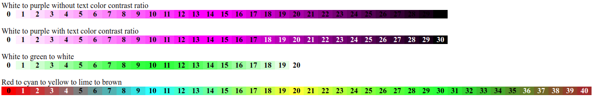

# Color Gradient

This library generates color gradients based on color gradient array and a given value.

## Installation

Use [Composer](http://getcomposer.org/) to install Color Gradient in your project:

```shell
composer require "zhb/color-gradient"
```

## Examples

<p align="center">
 
</p>
